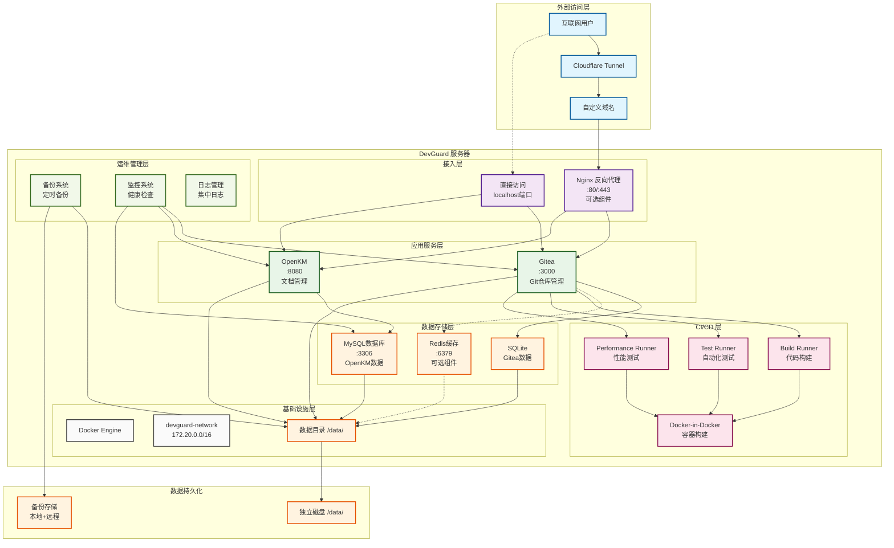
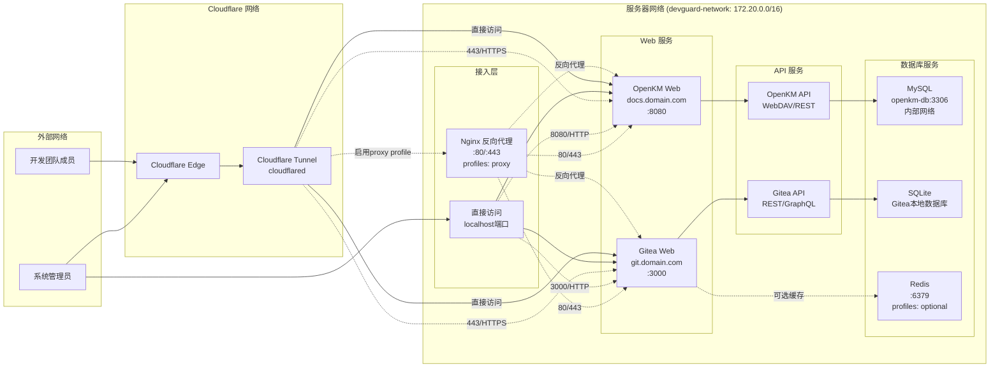
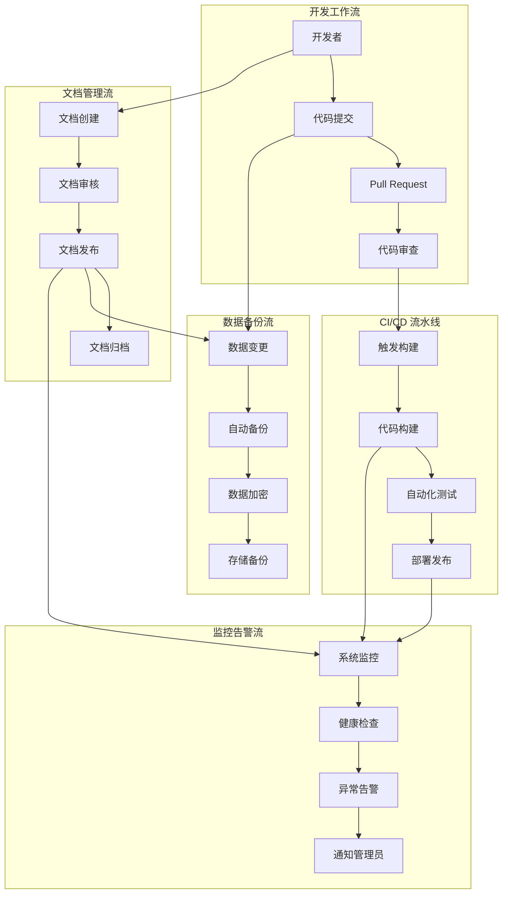
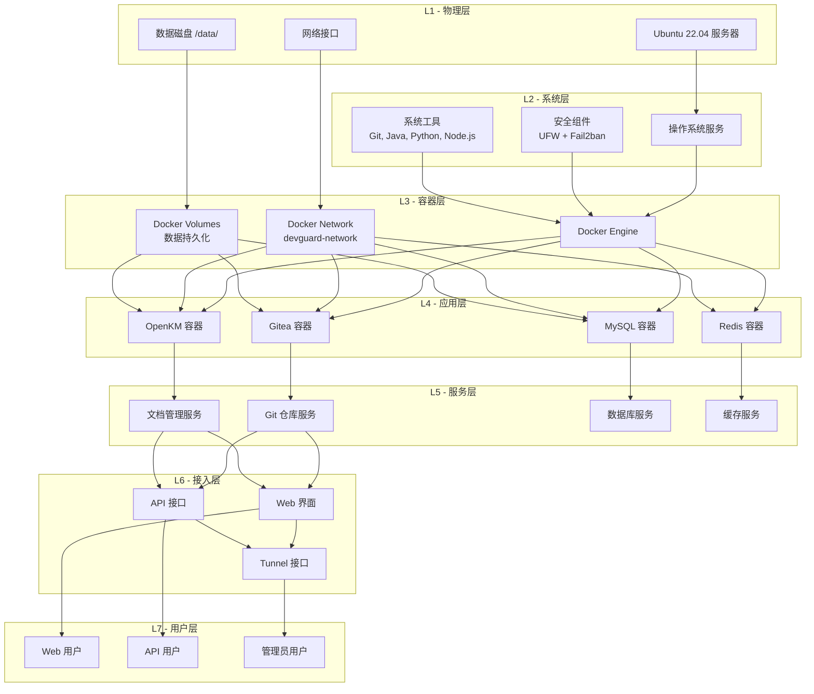

# DevGuard 一键部署方案

## 项目概述

DevGuard 是一个为初创团队设计的远程开发支持服务器，提供完整的开发工具链和协作平台。本项目基于您提供的设计文档，创建了完整的一键部署解决方案。

## 核心组件

- **Gitea**: Git 仓库管理和协作平台
- **OpenKM**: 企业文档管理系统
- **Cloudflare Tunnel**: 安全的远程访问通道
- **CI/CD Runners**: 自动化构建和测试环境
- **备份系统**: 自动化数据备份和恢复
- **监控系统**: 服务健康监控和告警

## 系统架构图

### 整体架构概览



### 网络架构详图



### 数据流架构图



### 部署架构层次图



## 项目结构

```
DevGuard/
├── deploy.sh                    # 一键部署主脚本
├── README.md                    # 原始设计文档
├── SYSTEM_REQUIREMENTS.md       # 系统要求文档
├── DEPLOYMENT_GUIDE.md          # 详细部署指南
├── README_DEPLOYMENT.md         # 本文档
├── scripts/                     # 部署脚本目录
│   ├── 01-system-setup.sh      # 系统基础配置
│   ├── 02-services-install.sh  # 服务安装脚本
│   ├── 04-configure-services.sh # 服务配置脚本
│   ├── 05-setup-backup.sh      # 备份系统配置
│   └── 06-setup-runners.sh     # CI/CD Runners配置
├── configs/                     # 配置文件模板
├── docker-compose/             # Docker Compose 文件
│   ├── all-services.yml        # 主要服务配置
│   └── runners.yml             # CI/CD Runners配置
└── examples/                    # 示例和模板文件
```

## 快速开始

### 1. 系统准备

确保您的系统满足以下要求：
- Ubuntu 22.04 LTS
- 至少 8GB RAM (推荐 16GB)
- 至少 100GB 存储空间 (推荐 500GB)
- Root 权限
- 稳定的网络连接

### 2. 下载部署包

```bash
# 将部署包复制到目标服务器
scp -r DevGuard/ root@your-server:/opt/
ssh root@your-server
cd /opt/DevGuard
```

### 3. 执行一键部署

```bash
# 赋予执行权限
chmod +x deploy.sh

# 执行一键部署
./deploy.sh
```

### 4. 选择部署模式

部署脚本提供以下选项：

1. **完整部署** (推荐) - 包含所有组件和功能
2. **基础部署** - 仅核心服务 (Gitea + OpenKM)
3. **自定义部署** - 选择特定组件
4. **单步部署** - 逐步执行每个阶段

## 部署流程详解

### 阶段 1: 系统基础配置 (`01-system-setup.sh`)

- 系统包更新和升级
- Docker 和 Docker Compose 安装
- 必要工具安装 (Git, Java, Python, Node.js)
- 防火墙和安全配置
- 系统性能优化
- 用户和目录结构创建

### 阶段 2: 服务安装 (`02-services-install.sh`)

- Docker 网络配置
- 环境变量生成
- Gitea 服务配置
- OpenKM 和 MySQL 配置
- Cloudflare Tunnel 安装
- 服务管理脚本创建

### 阶段 3: 服务配置 (`04-configure-services.sh`)

- Cloudflare Tunnel 配置和启动
- Gitea 初始化和配置
- OpenKM 初始化和配置
- SSL 证书配置
- 健康监控脚本配置

### 阶段 4: 备份系统 (`05-setup-backup.sh`)

- 备份目录结构创建
- 加密密钥生成
- 自动备份脚本配置
- 定时任务设置
- 恢复脚本配置

### 阶段 5: CI/CD Runners (`06-setup-runners.sh`)

- Build Runner 配置 (代码构建)
- Test Runner 配置 (自动化测试)
- Performance Runner 配置 (性能测试)
- Docker-in-Docker 服务
- 示例 Workflow 文件

## 配置要点

### 1. 数据目录结构

```
/data/                          # 主数据目录 (建议独立磁盘)
├── gitea/                     # Gitea 数据
├── openkm/                    # OpenKM 数据和文档
├── mysql/                     # MySQL 数据库
├── backups/                   # 备份数据
└── runners/                   # CI/CD 工作空间
```

### 2. 网络配置

- **内部端口**: 3000 (Gitea), 8080 (OpenKM), 3306 (MySQL)
- **外部访问**: 通过 Cloudflare Tunnel 或 Nginx 反向代理
- **防火墙**: 仅开放必要端口 (22, 80, 443)

### 3. 安全配置

- 自动生成强密码
- 加密备份数据
- Fail2ban 防护
- UFW 防火墙配置
- SSL/TLS 加密传输

## 🔐 安全最佳实践

### 推荐架构：Cloudflare + Nginx 双重防护

**为什么推荐使用 Nginx 代理？**

1. **端口安全** 🔒
   - 仅暴露 80, 443 端口
   - 隐藏后端服务端口 (3000, 8080)
   - 防止端口扫描和直接攻击

2. **双重防护** 🛡️
   - **Cloudflare 层**：DDoS 防护、WAF、地理位置过滤
   - **Nginx 层**：反向代理、访问控制、请求限流

3. **访问控制** 🚫
   - 企业邮箱用户过滤
   - IP 白名单/黑名单
   - 时间窗口限制
   - 管理员路径保护

### 启用 Nginx 代理模式
```bash
# 启用 Nginx 代理 (推荐)
docker-compose -f docker-compose/all-services.yml --profile proxy up -d

# 完整安全配置 (包含 Redis 缓存)
docker-compose -f docker-compose/all-services.yml --profile proxy --profile optional up -d
```

### Cloudflare 访问规则示例
```javascript
// 仅允许企业邮箱用户访问管理界面
(http.request.uri.path contains "/admin") and
(not http.request.headers["cf-access-authenticated-user-email"][0] matches ".*@company\.com$")

// 地理位置限制
ip.geoip.country ne "CN" and ip.geoip.country ne "US"

// 工作时间访问控制
not (http.request.timestamp.hour >= 9 and http.request.timestamp.hour <= 18)
```

详细安全配置请参考：[ARCHITECTURE_NOTES.md](./ARCHITECTURE_NOTES.md#cloudflare-访问规则配置示例)

## 管理命令

### 服务管理

```bash
# 查看所有服务状态
/opt/devguard/scripts/services/status.sh

# 启动所有服务
/opt/devguard/scripts/services/start-all.sh

# 停止所有服务
/opt/devguard/scripts/services/stop-all.sh
```

### 备份管理

```bash
# 手动备份
/opt/devguard/scripts/backup-manager.sh backup

# 查看备份状态
/opt/devguard/scripts/backup-manager.sh status

# 数据恢复
/opt/devguard/scripts/backup-manager.sh restore
```

### CI/CD Runners

```bash
# 启动 Runners
/opt/devguard/runners/scripts/start-runners.sh

# 查看 Runner 状态
/opt/devguard/runners/scripts/status-runners.sh

# 停止 Runners
/opt/devguard/runners/scripts/stop-runners.sh
```

## 访问信息

部署完成后，您可以通过以下方式访问服务：

### 本地访问

- **Gitea**: http://localhost:3000
- **OpenKM**: http://localhost:8080/OpenKM

### 远程访问 (配置 Cloudflare Tunnel 后)

- **Gitea**: https://git.yourdomain.com
- **OpenKM**: https://docs.yourdomain.com

### 默认账户

- **Gitea 管理员**: admin (密码在 `/opt/devguard/.env`)
- **OpenKM 管理员**: okmAdmin / admin (首次登录后请修改)

## 最佳实践

### 1. 安全建议

- 定期更新系统和应用
- 使用强密码和双因素认证
- 定期检查访问日志
- 及时应用安全补丁

### 2. 备份策略

- 每日自动备份重要数据
- 定期测试备份恢复
- 异地备份存储
- 保留多个备份版本

### 3. 监控维护

- 定期检查服务状态
- 监控系统资源使用
- 清理日志和临时文件
- 性能调优和优化

### 4. 扩展建议

- 根据团队规模调整资源配置
- 配置负载均衡 (如需要)
- 集成外部认证系统
- 添加更多 CI/CD 流水线

## 故障排除

### 常见问题

1. **服务无法启动**: 检查端口占用和权限
2. **数据库连接失败**: 验证密码和网络配置
3. **Cloudflare Tunnel 连接失败**: 检查 Token 和域名配置
4. **备份失败**: 检查磁盘空间和权限
5. **Runner 注册失败**: 验证 Gitea Token 和网络连接

### 日志位置

- **部署日志**: `/tmp/devguard-deploy.log`
- **服务日志**: `docker logs <container-name>`
- **系统日志**: `/var/log/syslog`
- **备份日志**: `/data/backups/logs/`

## 技术支持

### 文档资源

- <mcfile name="SYSTEM_REQUIREMENTS.md" path="d:\workroom\EDIS\DevGuard\SYSTEM_REQUIREMENTS.md"></mcfile> - 详细系统要求
- <mcfile name="DEPLOYMENT_GUIDE.md" path="d:\workroom\EDIS\DevGuard\DEPLOYMENT_GUIDE.md"></mcfile> - 完整部署指南
- 各组件官方文档

### 脚本说明

- <mcfile name="deploy.sh" path="d:\workroom\EDIS\DevGuard\deploy.sh"></mcfile> - 主部署脚本
- <mcfile name="01-system-setup.sh" path="d:\workroom\EDIS\DevGuard\scripts\01-system-setup.sh"></mcfile> - 系统配置
- <mcfile name="02-services-install.sh" path="d:\workroom\EDIS\DevGuard\scripts\02-services-install.sh"></mcfile> - 服务安装
- <mcfile name="04-configure-services.sh" path="d:\workroom\EDIS\DevGuard\scripts\04-configure-services.sh"></mcfile> - 服务配置
- <mcfile name="05-setup-backup.sh" path="d:\workroom\EDIS\DevGuard\scripts\05-setup-backup.sh"></mcfile> - 备份配置
- <mcfile name="06-setup-runners.sh" path="d:\workroom\EDIS\DevGuard\scripts\06-setup-runners.sh"></mcfile> - CI/CD 配置

## 版本信息

- **版本**: 1.0
- **目标系统**: Ubuntu 22.04 LTS
- **Docker**: 24.x
- **Docker Compose**: 2.x
- **创建日期**: 2024年

## 许可证

本项目遵循开源许可证，具体条款请参考相关组件的许可证要求。

---

**注意**: 
1. 请在生产环境部署前进行充分测试
2. 定期备份重要数据和配置
3. 保持系统和应用的及时更新
4. 遵循安全最佳实践

如有问题或需要技术支持，请参考详细文档或联系技术团队。